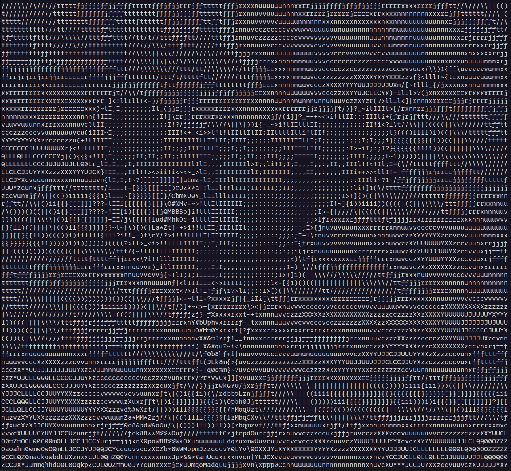
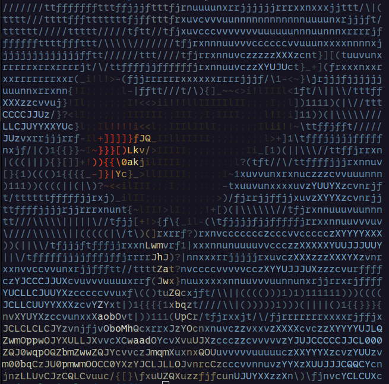

# Asciifier

Converts images into their ASCII art representation directly in your terminal, with optional color support!

Asciifier takes an image file, resizes it to your desired character dimensions, and maps pixel intensity (and optionally color) to ASCII characters and ANSI escape codes. It uses `scikit-image` for robust image handling and `concurrent.futures` for parallel processing to speed up the conversion of larger images.

## Features

*   **Image to ASCII:** Converts common image formats (PNG, JPG, BMP, TIFF, etc.) into text-based art.
*   **Color Output:** Supports 24-bit ANSI color escape codes to represent the original image colors in compatible terminals.
*   **Grayscale Option:** Easily switch to classic grayscale ASCII art.
*   **Custom Dimensions:** Specify the desired output height and width in characters.
*   **Parallel Processing:** Utilizes multiple CPU cores for faster conversion.
*   **Simple CLI:** Easy-to-use command-line interface.

## Installation

It's recommended to install Asciifier within a Python virtual environment.

1.  **Clone the repository:**
    ```bash
    git clone https://github.com/Andrealavi/asciifier.git
    cd asciifier
    ```

2.  **Create and activate a virtual environment (optional but recommended):**
    ```bash
    # Windows
    python -m venv venv
    .\venv\Scripts\activate

    # macOS / Linux
    python3 -m venv venv
    source venv/bin/activate
    ```

3.  **Install the package:**
    This command installs Asciifier and all its dependencies listed in `pyproject.toml`.
    ```bash
    pip install .
    ```
    After installation, the `asciifier` command will be available in your environment.

## Usage

The basic command structure is:

```bash
asciifier [OPTIONS] <filename>
```

Where `<filename>` is the path to the image you want to convert.

**Options:**

*   `filename`: (Required) Path to the input image file.
*   `--output`, `-o`: Output file name for the ASCII art. (Default: `output.txt`)
*   `--shape HEIGHT WIDTH`: Output dimensions (height width) in characters. (Default: `256 256`)
*   `--grayscale`, `-gs`: Force the output ASCII art to be grayscale (no color codes). Use `--no-grayscale` to explicitly request color if the default behavior changes. (Default: Color if image has color channels)

**Examples:**

1.  **Basic conversion (color, default size 256x256, output to `output.txt`):**
    ```bash
    asciifier my_image.jpg
    ```

2.  **Specify output file:**
    ```bash
    asciifier photo.png -o my_ascii_art.txt
    ```

3.  **Specify output dimensions (80 characters wide, 40 characters high):**
    ```bash
    asciifier logo.bmp --shape 40 80
    ```

4.  **Convert to grayscale:**
    ```bash
    asciifier color_picture.tiff --grayscale
    ```

5.  **Combine options (grayscale, 100x50, specific output file):**
    ```bash
    asciifier landscape.webp -o small_art.txt --shape 50 100 --grayscale
    ```

## Example Output

This example shows the usage of `asciifier` on the image given in the tests folder.



**Color Output Screenshot:**



## Dependencies

Key dependencies include:

*   `numpy`
*   `scikit-image`

All dependencies are listed in `pyproject.toml` and are installed automatically when you run `pip install .`.
